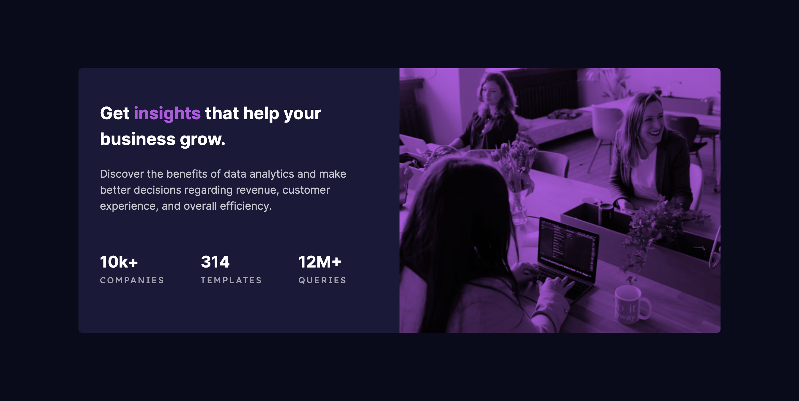

# Frontend Mentor - Stats preview card component solution

This is a solution to the [Stats preview card component challenge on Frontend Mentor](https://www.frontendmentor.io/challenges/stats-preview-card-component-8JqbgoU62). Frontend Mentor challenges help you improve your coding skills by building realistic projects.

## Table of contents

- [Overview](#overview)
  - [The challenge](#the-challenge)
  - [Screenshot](#screenshot)
  - [Links](#links)
- [My process](#my-process)
  - [Built with](#built-with)
  - [What I learned](#what-i-learned)
  - [Useful resources](#useful-resources)
- [Author](#author)

## Overview

### The challenge

Users should be able to:

- View the optimal layout depending on their device's screen size

### Screenshot




### Links

- Solution URL: [Frontend Mentor](https://www.frontendmentor.io/profile/digitallimat)
- Live Site URL: [GitHub](https://digitallimat.github.io/Stats-preview-card-component)

## My process

### Built with

- Semantic HTML5 markup
- CSS custom properties
- Flexbox
- CSS Grid
- Mobile-first workflow

### What I learned

```css
.card__hero {
  order: 1;
  mix-blend-mode: multiply;
}
```

### Useful resources

- [MDN](https://developer.mozilla.org/en-US/) - This helped me for quick references.
- [W3Schools](https://www.w3schools.com/cssref/pr_mix-blend-mode.php) - CSS mix-blend-mode Property

## Author

- Website - [Digitallimat.com](https://www.digitallimat.com)
- Frontend Mentor - [@digitallimat](https://www.frontendmentor.io/profile/digitallimat)
- Twitter - [@digitallimat](https://www.twitter.com/digitallimat)
